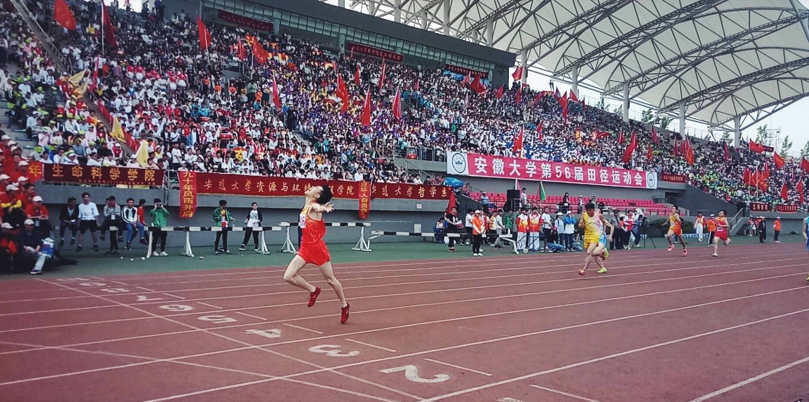

## 电院田径队&ensp;&ensp;介绍与答疑

 
>很多事情，只有真正开始做的时候，才会明白：努力从来不等于成功，而成功也从来不是终极目标。那些终极目标的梦想，其实是很难实现的。但你在追逐梦想的时候，你会找到一个更好的自己，一个拼搏、努力、自信的自己，你会因为自己所做的事情而觉得充实。

 

### 1、电院田径队是什么？
电院田径队就是一群爱好运动的朋友聚在一起训练、玩耍、交流、学习运动知识、增强身体素质，享受各种福利的充满温情和凝聚力的组织。电院田径队的主要职责是带领大家快乐训练，增强体质，丰富大学生活，并在每年4月的校运会上收获奖牌和奖金（优秀的同学有机会进入校队并参加省运会）。电院田径队现阶段的目标是在20多个学院参与的校运会中获得四连冠。

电院田径队创立的时间相对不久，但自创立之初就奔着校运会第一名而去。电院田径队也曾受到别人的嘲笑，但如今电院是三冠王，743111是他的过往。

### 2、电院田径队什么时候开始训练，每次训练怎么安排？
田径队的训练分为冬训、春训两个阶段。

冬训一般在每年10月的院运会结束之后开始，持续到12月期末考试的前两周左右结束（提前结束的两周留给大家认真复习期末考试，学习不可落下）。

春训一般在每年第二学期开学的一周内开始（也就是过完寒假回校的那一周），持续到4月校运会开始的前一两周（校运会的前一两周作为恢复期，运动量显著减少，助大家在比赛中获得最好状态）。春训和冬训总训练周数大约为18周。

田径队一般在每周的周一、三、五下午2节课后开始训练，直到下午6点15分左右结束。

田径队的每次训练分为三个同等重要的部分：热身、训练、放(推)松(拿）。热身与训练在豪华、人少的北体育场（前几周会在南体训练），放松环节在理工楼，即电子学院楼。

### 3、训练与下午、晚上的课程冲突怎么办？晚上还有时间洗澡吗？
田径队会以大家的课程安排为第一优先级。

训练当天下午有三节课的，三节课下课后来训练；当天下午满课的，可能就不能来一起happy了，不过学长学姐有私自与老师调课到其他时间段的先例。
训练不占用晚上上课时间，不会与晚上的课程冲突。

如果晚上没有课程，洗澡的时间是很充足的。如果晚上有课，那留给洗澡的时间可能比较紧，建议大家买一个洗澡神器（淘宝搜：洗澡神器 自吸式），以后就可以晚上上完课，回寝室楼打热水直接在寝室洗澡了。

### 4、加入田径队有什么门槛？
田径队的运作机制决定了其不同于很多其他组织与社团。加入田径队不需要面试，也不需要个人当前优异的身体素质，田径队更加看重大家的**毅力**与**潜质**。

多数的组织社团招得的新人需要进入部门便进行有一定专业度的工作，工作事项相对田径队较为密集，同时组织社团的招新名额有限，所以需要进行人员的筛选工作。

而田径队并不需要大家刚入队便参加比赛、田径队一年仅有一个目标即校运会、田径队有能力招纳并培养较多的新人。

### 5、怎么加入田径队？
上一个回答说到田径队更看重大家的毅力。积极参加田径队第一周的训练并在之后的训练中也积极参与的同学即算加入了田径队。

### 6、我比较菜，加入田径队会有收获吗？
菜？大佬别装啦，你只是还没有爆发你的潜能。大家从高中过来，几乎都没系统训练过，水平都是差不多的，天赋异禀的人很少。想要获得一个好的身体素质、校运会取得一个好的名次，更多需要的是坚持，现在的身体素质对一年后的身体素质来说参考价值不大，电院田径队是可以带大家起飞的。

**加入田径队没有门槛，但想要在田径队有所收获，必须要有足够的毅力与良好的态度，认真对待，否则便是既浪费了自己的时间、毫无所得，也消耗了学长学姐与教练的精力。**

### 7、田径队分不同的组别吗？
田径队会根据大家的特长和自己的意愿进行分组，分组一般在训练一段时间后进行。组别有短跑组、长跑组、跨栏组、投掷组（调高跳远等项目暂未设置组别）。

值得一提的是，如果你的跑步能力不强，但你有较强的手、腿部力量，你也可以参加投掷组，一起撸铁、健身。

### 8、电院田径队是如何培养大家的？
大家加入田径队以后，学长学姐在前几次的训练中会教大家热身的基本步骤，进行基本的体能适应和身体素质锻炼。在之后的训练中也会对大家进行起跑、摆臂、抬腿等跑步动作的纠正。

训练的前几周量不会特别大，随时间推移量会慢慢增大。径组常见的训练项目有30m跑、60m跑、100m跑、力量训练等（投掷组会进行铁饼标枪等技术教学）。同时也会在适当的时候进行放(推)松(拿)手法教学。

每次的训练计划由咱们院的专业教练丁教练制定，丁教练会根据大家的训练状态和以往的训练内容安排下一次的训练内容，科学地助大家提高能力。教练也会偶尔来田径场指导大家的训练。

### 9、田径队训练影响学习吗？
对于十分自律的人，训练只会让他充满活力。对于十分颓废的人，不参加训练空出来的时间只会被用来打游戏消遣。

田径队里面各种大佬云集。学生会团支部书记、导生、班长、团支书、班级第一、国家奖学金获得者、三好学生标兵……队里有各种各样的大佬，我们的目标是学霸田径队，我们要证明我们不仅仅是能跑能跳！

成绩优秀的同学如胡佳杰学长、叶远青学姐、江浩林学长、陈锦莎学姐，以及如今已经在科大读研的十佳青年胡科学长等，大家都可以去了解，了解运动、学习等各个方面的信息。

### 10、训练晒不晒？
我们会主要在北体育场大棚的阴影下训练，而且冬春时节，太阳落山时间也会很早。当然前几次在南体的训练会稍微有点晒。

### 11、训练累不累？
累并快乐着～

### 12、院运会是什么？
院运会就是在每年10月-11月期间，学院举行的运动会，届时会以各个班级为单位进行互相之间的竞赛。田径队的学长学姐们届时也会到场带大家进行热身教学。

院运会场面没有校运会宏大，不过这是大家体验校运会气氛和比赛氛围的一次很好的机会（今年疫情原因，是否举办目前未知）。

### 13、校运会是什么？
每年4月份，磬苑校区都会举办一场安大最隆重的活动，没有之一。8000人容量的北体育场里座无虚席，呐喊声、擂鼓声，不绝于耳。历时3整天，甲乙组合计50多个竞赛项目；20多个院系，逾1000名运动员参与角逐……

想要更好地了解校运会，欢迎观看安徽大学电视台 ([安徽大学融媒体中心](https://space.bilibili.com/158393127/) )在校运会期间制作的视频：《[听歌看校运](https://b23.tv/RYccTh)》 和 《[拼途有你](https://b23.tv/R1ZN9r)》

### 14、田径队福利？
1、获得运动知识与技巧、毅力、朋友、归属感，在几千人面前展示自己速度与力量的机会。获得其他学院的同学看到你穿着电院田径队队服时羡慕的眼神（三冠王实力不是吹的）。

2、在电院田径队，每次训练都有经济补贴，补贴会在下一年统一发放（当次训练缺勤，则没有当次补贴；提前退出田径队没有补贴）。

购买的钉鞋也会进行适当的补贴。

校运会比赛中每得1分会有30元奖金（电院田径队在某年得了差不多400分）。

校运会破纪录可得1000元奖金。

3、比赛前有动员大会，比赛后有表彰大会，届时有院长、书记出席。平时训练，每天都安排2位轮值辅导员。这是院里面任何一个其他体育组织都无缘的。

4、在田径队训练有保研加分奖励。对于大多数想保研的同学，在大一没有太多专业背景进行学科竞赛与科研的情况下，加入田径队是个很不错的选择

当然，仅对于大一同学来说如此。对于大三或大二同学来说，有志深造者建议将重心放在跟着导师做科研、项目，提前体验研究生生活方面。

5、找到刻骨铭心的另一半（是真话），接触到优秀的同学与学长学姐们。

6、有时会获得腰酸背痛腿抽筋福利，演老弱病残杠杠滴，可以省一大笔化妆费。

~~7、安大大体部针对体育课有一项政策：当前学期获得校级即以上体育奖项的，可以免上体育课，期末考核时免专项考核（只是免考专项考核，剩下的一些考核不免考）（此条政策现在可能已经有所改变，需要打听清楚）。~~

 
 
 
 
 
 
 

-----------------------------
如果对田径队或此文档有任何疑问或建议，可发送任何非正式邮件至 xcseven@foxmail.com ，欢迎打扰！    

Version 1.2.1    

2020/10/07

